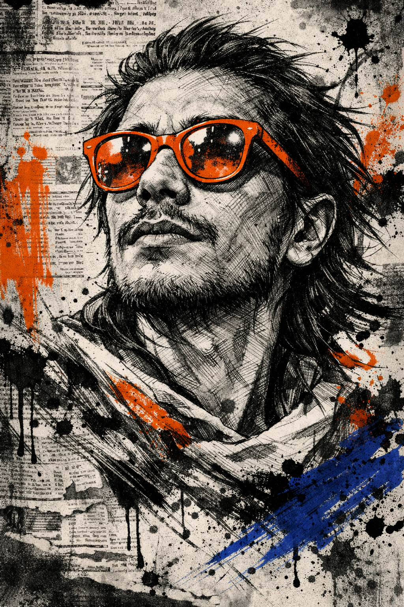

# Signal in the Noise



## Copy-ready prompt (JSON)

Use the GitHub copy button on the code block (top-right) to copy in one click.

```json
{
  "meta": {
    "image_quality": "High",
    "image_type": "Mixed Media (Trash Polka Collage)",
    "reference_image_usage": "Use the provided reference image strictly for facial identity matching only. Match facial structure, skin tone, beard density, hair texture, and proportions exactly. Do not copy lighting, pose, glasses, or background from the reference.",
    "resolution": "Ultra high resolution, sharp focus",
    "style_consistency": "Strict"
  },
  "subject": {
    "pose": "Looking upward, three-quarter angle",
    "expression": "Expressive, contemplative",
    "hair": "Messy, windswept, slightly long, sketch-like strokes",
    "beard": "Full, textured, heavy ink line work",
    "glasses": {
      "type": "Sunglasses",
      "color": "Bright orange",
      "material": "Translucent",
      "finish": "Glossy",
      "frame": "Thick",
      "priority": "Must remain the dominant color accent"
    }
  },
  "art_style": {
    "primary_style": "Trash Polka",
    "base_layer": "Realistic black-and-white hand-drawn ink sketch",
    "line_quality": "Rough pencil lines, visible cross-hatching",
    "overlays": ["Bold abstract paint splashes", "Paint splatters"],
    "overlay_colors": ["Vivid orange", "Deep blue"],
    "texture": "Gritty, raw, analog, intentional imperfections"
  },
  "background": {
    "composition": "Layered vintage newspaper clippings",
    "color": "Grayscale, slightly faded",
    "text_usage": "Visible but not readable, purely textural",
    "arrangement": "Collage layout"
  },
  "lighting": {
    "type": "Dramatic, directional",
    "contrast": "High",
    "purpose": "Emphasize facial contours and sketch depth"
  },
  "aesthetic": {
    "mood": ["Cinematic", "Bold", "Expressive", "Editorial poster"],
    "restrictions": ["No clean gradients", "No smooth digital painting"]
  }
}
```

## Notes

- Reference image usage: facial identity matching only (no pose/lighting/background copying).
- Keep the orange sunglasses as the dominant color accent.
