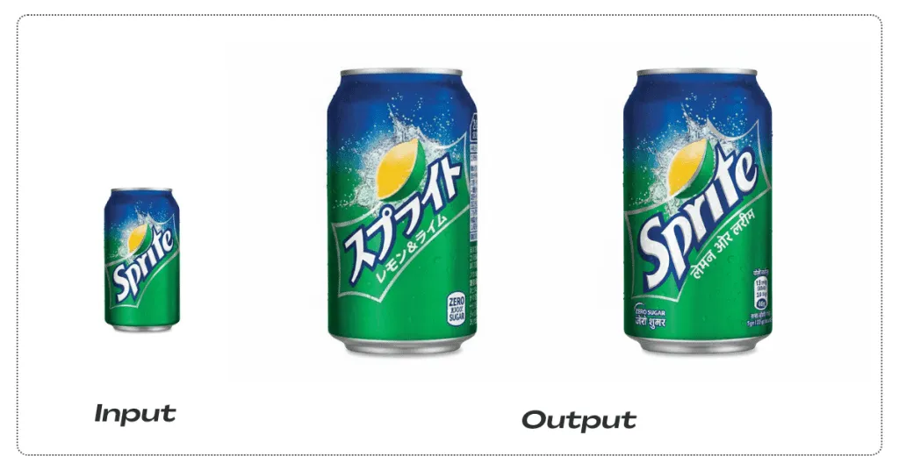

# Localize Product Packaging For 6 Countries



## Generator

Gemini Nano Banana Pro

## Copy-ready prompt

Use the GitHub copy button on the code block (top-right) to copy in one click.

```text
Upload: Product packaging photo or flat design with English text.

Localize this exact packaging design into 6 language versions:
1) Japanese
2) Arabic
3) Spanish
4) German
5) Simplified Chinese (Mandarin)
6) Hindi (Devanagari script)

Translate ALL visible text into the correct language for each version. Preserve the layout exactly: same logo position, colors, shapes, and imagery. For Japanese, keep vertical text where appropriate. For Arabic, use proper right‑to‑left layout. Make all text sharp, aligned, and professional, as if originally designed in that language.

Deliver 6 separate images, each clearly showing the localized packaging, at 4K resolution suitable for print mockups.
```
