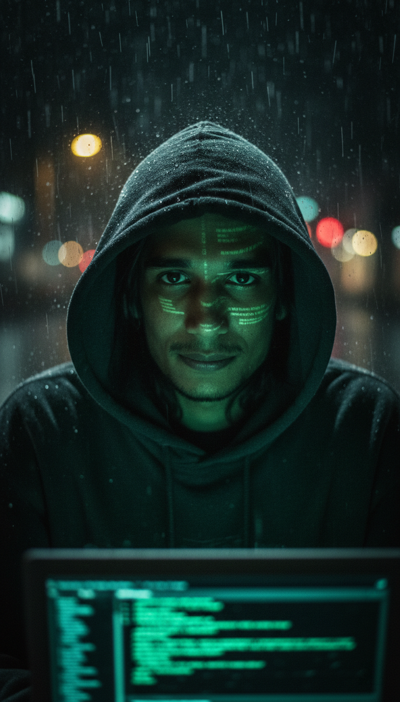

# Mr. Robot



## Generator

Gemini Nano Banana Pro

## Copy-ready prompt

Use the GitHub copy button on the code block (top-right) to copy in one click.

```text
A portrait using my face, depicted as a hacker in a dark, rainy urban environment, strongly in the style of Mr. Robot. The subject is wearing a large hooded sweatshirt, covering the entire head but leaving the face visible, looking at the camera, with a computer screen reflecting a soft green code onto their face.

The lighting is dramatic and low-contrast, with only the monitor light and some blurred streetlights in the background. There is a sense of isolation and paranoia.

The image has a grainy, almost cinematic aesthetic, reminiscent of modern noir films, with a focus on technology and surveillance.
```
